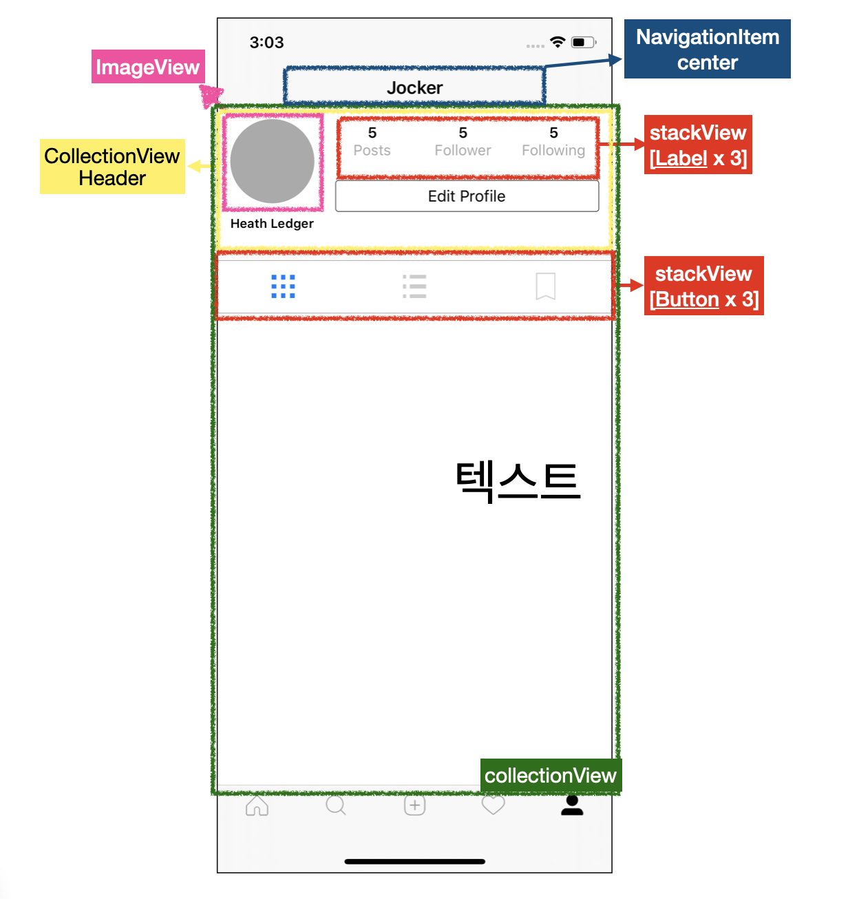

#  Profile Menu with CollectionView

## 구현 화면



- 기본 UI
  - 사용자가 로그인 한 다음 자신의 프로필 사진 및 기타 정보를 확인할 수 있는 페이지
  - 사용자가 올린 이지들을 확인 가능
  - 사용자가 팔로우한 사용자 수, 사용자를 팔로잉한 사용자 수 표기
- 구현 기술
  - Firebase 연결 하여 Header에 실제 사용자 정보 추가

## 소스코드

- UserProfile.swift

```swift
import UIKit
import Firebase

private let reuseIdentifier = "Cell"
private let headerIdentifier = "UserProfileHeader"

class UserProfileVC: UICollectionViewController, UICollectionViewDelegateFlowLayout {
    
    var user: User?
    
    override func viewDidLoad() {
        super.viewDidLoad()

        // MARK: - Properties
        // Register cell classes
        // collectionView의 일반 Cell 표시
        collectionView.register(UICollectionViewCell.self, forCellWithReuseIdentifier: reuseIdentifier)
        // collectionView의 Header를 표시
        collectionView.register(UserProfileHeader.self, forSupplementaryViewOfKind: UICollectionView.elementKindSectionHeader, withReuseIdentifier: headerIdentifier)

        //backgtound color
        self.collectionView.backgroundColor = .white
        
        // 사용자 정보 추출을 위한 API (현재 미사용)
        fetchCurrentUserData()
    }
    
    // MARK: - UICollectionViewDataSource
    
    override func numberOfSections(in collectionView: UICollectionView) -> Int {
        // #warning Incomplete implementation, return the number of sections
        return 1
    }
    
    override func collectionView(_ collectionView: UICollectionView, numberOfItemsInSection section: Int) -> Int {
        // collectionVeiw 를 통해서 보여줄 아이탬 갯수
        return 0
    }
    
    func collectionView(_ collectionView: UICollectionView, layout collectionViewLayout: UICollectionViewLayout, referenceSizeForHeaderInSection section: Int) -> CGSize {
      	//Header cell의 사이즈 리턴 함수
        return CGSize(width: view.frame.width, height: 200)
    }
    
    override func collectionView(_ collectionView: UICollectionView, viewForSupplementaryElementOfKind kind: String, at indexPath: IndexPath) -> UICollectionReusableView {
        // Header 정의
        let header = collectionView.dequeueReusableSupplementaryView(ofKind: kind, withReuseIdentifier: headerIdentifier, for: indexPath) as! UserProfileHeader
        let currentUid = Auth.auth().currentUser?.uid
	
//Firebase연결하여 사용자 정보(dictionary)를 받아옴
Database.database().reference().child("users").child(currentUid!).observeSingleEvent(of: .value) { (snapshot) in
            guard let dictionanry = snapshot.value as? Dictionary<String, AnyObject> else { return }
            let uid = snapshot.key
            let user = User(uid: uid, dictionary: dictionanry)
            self.navigationItem.title = user.username
            header.user = user
        }
        return header
    }
    
    func collectionView(_ collectionView: UICollectionView, layout collectionViewLayout: UICollectionViewLayout, sizeForItemAt indexPath: IndexPath) -> CGSize {
        //header의 크기 지정
        return CGSize(width: view.frame.width - 30 * 2, height: 50)
    }
    
    override func collectionView(_ collectionView: UICollectionView, cellForItemAt indexPath: IndexPath) -> UICollectionViewCell {
        let cell = collectionView.dequeueReusableCell(withReuseIdentifier: reuseIdentifier, for: indexPath)
        // cell의 모양 및 크키 등을 지정
        return cell
    }
    
    //MARK - API
    
    func fetchCurrentUserData() {
        //get user data
        
    }
}
```

- UserProfileHeader.swift

```swift
import UIKit

class UserProfileHeader: UICollectionReusableView {

  var user: User? {
    didSet {
      let fullname = user?.name
      nameLabel.text = fullname
    }
  }

  let profileImageView: UIImageView = {
    let iv = UIImageView()
    iv.contentMode = .scaleAspectFill
    iv.clipsToBounds = true
    iv.backgroundColor = .lightGray
    return iv
  }()

  let nameLabel: UILabel = {
    let label = UILabel()
    label.text = "Heath Ledger"
    label.font = UIFont.boldSystemFont(ofSize: 12)
    return label
  }()

  let postsLabel: UILabel = {
    let label = UILabel()
    label.numberOfLines = 0
    label.textAlignment = .center
    let attributedText = NSMutableAttributedString(string: "5\n", attributes: [NSAttributedString.Key.font: UIFont.boldSystemFont(ofSize: 14)])
    attributedText.append(NSAttributedString(string: "Posts", attributes: [NSAttributedString.Key.font: UIFont.systemFont(ofSize: 14), NSAttributedString.Key.foregroundColor: UIColor.lightGray]))
    label.attributedText = attributedText
    return label
  }()

  let followersLabel: UILabel = {
    let label = UILabel()
    label.numberOfLines = 0
    label.textAlignment = .center
    let attributedText = NSMutableAttributedString(string: "5\n", attributes: [NSAttributedString.Key.font: UIFont.boldSystemFont(ofSize: 14)])
    attributedText.append(NSAttributedString(string: "Follower", attributes: [NSAttributedString.Key.font: UIFont.systemFont(ofSize: 14), NSAttributedString.Key.foregroundColor: UIColor.lightGray]))
    label.attributedText = attributedText
    return label
  }()

  let followingLabel: UILabel = {
    let label = UILabel()
    label.numberOfLines = 0
    label.textAlignment = .center
    let attributedText = NSMutableAttributedString(string: "5\n", attributes: [NSAttributedString.Key.font: UIFont.boldSystemFont(ofSize: 14)])
    attributedText.append(NSAttributedString(string: "Following", attributes: [NSAttributedString.Key.font: UIFont.systemFont(ofSize: 14), NSAttributedString.Key.foregroundColor: UIColor.lightGray]))
    label.attributedText = attributedText
    return label
  }()

  let editProfileButton: UIButton = {
    let button = UIButton(type: .system)
    button.setTitle("Edit Profile", for: .normal)
    button.layer.cornerRadius = 3
    button.layer.borderColor = UIColor.black.cgColor
    button.layer.borderWidth = 0.5
    button.setTitleColor(.black, for: .normal)
    return button
  }()

  let gridButton: UIButton = {
    let button = UIButton(type: .system)
    button.setImage(#imageLiteral(resourceName: "grid"), for: .normal)
    return button
  }()

  let listButton: UIButton = {
    let button = UIButton(type: .system)
    button.setImage(#imageLiteral(resourceName: "list"), for: .normal)
    button.tintColor = UIColor(white: 0, alpha: 0.2)
    return button
  }()

  let bookmarkButton: UIButton = {
    let button = UIButton(type: .system)
    button.setImage(#imageLiteral(resourceName: "ribbon"), for: .normal)
    button.tintColor = UIColor(white: 0, alpha: 0.2)
    return button
  }()

  override init(frame: CGRect) {
    super.init(frame: frame)
		// 이미지 뷰 추가
    addSubview(profileImageView)
    profileImageView.anchor(top: self.topAnchor, left: leftAnchor, bottom: nil, right: nil, paddingTop: 16, paddingLeft: 12, paddingBottom: 0, paddingRight: 0, width: 80, height: 80)
    profileImageView.layer.cornerRadius = 80 / 2
		// 이름 라벨 추가
    addSubview(nameLabel)
    nameLabel.anchor(top: profileImageView.bottomAnchor, left: self.leftAnchor, bottom: nil, right: nil, paddingTop: 12, paddingLeft: 12, paddingBottom: 0, paddingRight: 0, width: 0, height: 0)

    // User prifile information add
    configureUserStats()
    
    //edit Profile 버튼 연결
    addSubview(editProfileButton)
    editProfileButton.anchor(top: postsLabel.bottomAnchor, left: profileImageView.rightAnchor, bottom: nil, right: self.rightAnchor, paddingTop: 12, paddingLeft: 20, paddingBottom: 0, paddingRight: 12, width: 0, height: 30)

    configureBottonToolBar()

  }

  required init?(coder aDecoder: NSCoder) {
    fatalError("init{coder:} has note been impemented")
  }
	
  func configureBottonToolBar() {
    let topDividerView = UIView()
    topDividerView.backgroundColor = .lightGray

    let bottomDividerView = UIView()
    bottomDividerView.backgroundColor = .lightGray
		// 버튼 3개 stackView 생성
    let stackView = UIStackView(arrangedSubviews: [gridButton, listButton, bookmarkButton])
    stackView.distribution = .fillEqually
    stackView.axis = .horizontal

    addSubview(stackView)
    addSubview(topDividerView)
    addSubview(bottomDividerView)
		// view 표현 형태 조정 버튼 추가
    stackView.anchor(top: nil, left: leftAnchor, bottom: self.bottomAnchor, right: rightAnchor, paddingTop: 0, paddingLeft: 0, paddingBottom: 0, paddingRight: 0, width: 0, height: 50)
		// lightGray 윗 실설 추가
    topDividerView.anchor(top: stackView.topAnchor, left: leftAnchor, bottom: nil, right: rightAnchor, paddingTop: 0, paddingLeft: 0, paddingBottom: 0, paddingRight: 0, width: 0, height: 0.5)
		// lightGray 아래 실설 추가
    bottomDividerView.anchor(top: stackView.bottomAnchor, left: leftAnchor, bottom: nil, right: rightAnchor, paddingTop: 0, paddingLeft: 0, paddingBottom: 0, paddingRight: 0, width: 0, height: 0.5)
  }
  
	// stackView를 사용한 화면 구성 방법
  func configureUserStats() {
    let stackView = UIStackView(arrangedSubviews: [postsLabel, followersLabel, followingLabel])

    stackView.axis = .horizontal
    stackView.distribution = .fillEqually

    addSubview(stackView)
    stackView.anchor(top: self.topAnchor, left: profileImageView.rightAnchor, bottom: nil, right: rightAnchor, paddingTop: 12, paddingLeft: 12, paddingBottom: 0, paddingRight: 12, width: 0, height: 50)
  }
}

```


## Important Thing

## Firebase로 부터 데이터 추출

- Firebase로 부터 데이터 추출 코드

```swift
func fetchCurrentUserData() {
  //get user data
  guard let currentUid = Auth.auth().currentUser?.uid else { return }          Database.database().reference().child("users").child(currentUid).observeSingleEvent(of: .value) { (snapshot) in
            
  print(snapshot)
  //기존 코드
  //guard let username = snapshot.value as? String else {return}
  //self.navigationItem.title = username
  }
}
```

- 실제 Firebase 내부의 데이터 저장 방식


- Xcode를 통해 불러온 데이터 확인

****