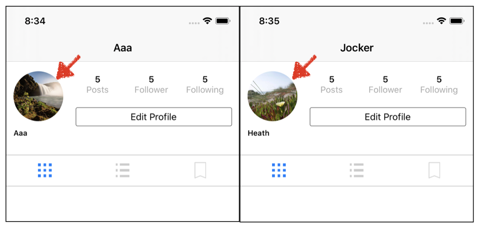

# UserProfile 내 ProfileImage추가

## 구현 화면

-   UserProfile화면내 가입시 사용자가 등록한 프로필 사진을 보여줌



## 소스코드

- extention.swift
  - 사용자의 프로필 이미지를 Firebase 에서 받아서 추가하는 기능 구현
    1. UserProfileView를 띄울때마다 이미지를 불러오는 것을 방지하기 위해서 imageCache 변수를 생성하고, Firebase에서 받아온 이미지 임시 저장
    2. 

```swift
// 이미지를 페이지가 로딩될때마다 불러오는 것을 방지하기 위한 이미지 저장 변수
var imageCache = [String:UIImage]()
extension UIImageView {
		// 전달인자를 통해 Url이 담긴 string 변수 받음
    func loadImage(with urlString: String) {
  			// 이미지가 이미 imageCache에 저장되어 있는 경우 재로드 방지
        if let cachedImage = imageCache[urlString] {
            self.image = cachedImage
            return
        }
        // 이미지가 케쉬 영역에 존제하지 않는 경우 아래 코드 실행
	      // 함수의 파라미터로 받은 String값을 URL함수를 통해 url주소로 변경
        guard let url = URL(string :urlString) else { return }
      	// Url을 통해 접속하여 데이터 다운로드
        URLSession.shared.dataTask(with: url) { (data, response, error ) in
        // 에러처리    
				if let error = error {
                print("Failed to load image with error", error.localizedDescription)
            }
            
            // 이미지 데이터
            guard let imageData = data else {return}
            // 이미지 데이터를 통해서 이미지 생성
            let photoImage = UIImage(data: imageData)
            
            // 불러온 이미지를 케쉬 이미지 변수에 저장
            imageCache[url.absoluteString] = photoImage
						// 큐에 작업을 넣어두고 끝날때까지 기다림                                               
            DispatchQueue.main.sync {
                self.image = photoImage
            }
        }.resume()
    }
}
```

- UserProfileHeader.swfit 

```swift
// 해당 swift파일 내에 user변수
// didSet 메소드를 통해서 user의 변경사항이 있을경우 안에 정의된 사항을 실행
// 해당 user는 ProfileView의 collectionView내에 header파일이 만들어 질때 생성됨
// Firebase 로 부터 사용자의 데이터를 딕셔너리 형태로 받아옴
var user: User? {
  didSet {
    let fullname = user?.name
    nameLabel.text = fullname
		// header를 생성할때 UserProfileImage가 같이 생성됨으로 이곳에 생성
    guard let profileImageUrl = user?.profileImageUrl else { return }
    profileImageView.loadImage(with: profileImageUrl)
  }
}
```

- UserProfileVC.swift 내 Collection View 내에 Header부분

```swift
override func collectionView(_ collectionView: UICollectionView, viewForSupplementaryElementOfKind kind: String, at indexPath: IndexPath) -> UICollectionReusableView {
      // Header 정의
      let header = collectionView.dequeueReusableSupplementaryView(ofKind: kind, withReuseIdentifier: headerIdentifier, for: indexPath) as! UserProfileHeader
      let currentUid = Auth.auth().currentUser?.uid
        Database.database().reference().child("users").child(currentUid!).observeSingleEvent(of: .value) { (snapshot) in
          guard let dictionanry = snapshot.value as? Dictionary<String, AnyObject> else { return }
          let uid = snapshot.key
                                                                                                          					// 여기서 user의 내용이 변경됨
          let user = User(uid: uid, dictionary: dictionanry)
          self.navigationItem.title = user.username
          header.user = user
      }
      return header
  }
```


## Important Thing

### DispatchQueue

- 정의
  - App의 main쓰레드나 background 쓰레드 에서 task 들의 실행을 관리하는 오브젝트
    - serially : 순차적으로 실행
    - concurrently : 병렬적으로 실행
    - sync : 큐에 넣은 작업이 끝날때까지 기다림
    - async : 큐에 작업을 추가하기만 할뿐 완료 여부는 보장하지 않음
- 기능적 부분
  - Serial - Sync
  - Serial - Async
  - Concurrent - Sync
  - Concurrent - Async

- 소스코드 일부분

```swift
DispatchQueue.main.sync {
  self.image = photoImage
}
// 해당코드에서는 Sync가 사용되었으며
// 이는 self.image = photoImage가 끝날때까지 기다렸다가 나머지 코드를 실행함
```


## Reference

- [swift. GCD 기초 정리하기 1](https://devmjun.github.io/archive/1-GCD)
-  [iOS ) GCD - Dispatch Queue사용법 (1)](https://zeddios.tistory.com/516) 